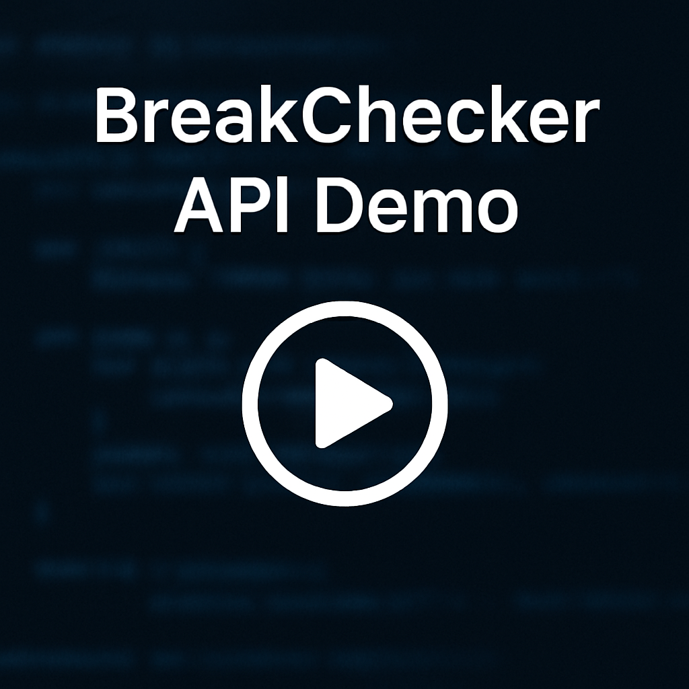

# BreakChecker Microservice

BreakChecker is a domain discovery and breach checking tool. It can scan a
website, harvest any emails or phone numbers, and verify them against breach
sources. The project provides both a command line interface and a small Django
REST API.

## How it works

The scanner runs in several distinct stages:

1. **Enumerate subdomains** —  `subfinder` is used when available and falls back 
   to free services like crt.sh, HackerTarget and Anubis DB.
2. **Check accessibility** — each discovered subdomain is probed for HTTP/HTTPS
   support so only reachable hosts are crawled.
3. **Crawl the site** — an internal asynchronous crawler collects pages with
   Playwright. Links and scripts are followed up to the configured depth.
4. **Extract contacts** — emails and phone numbers are validated, normalized and
   stored together with the page on which they were seen.
5. **Breach lookups** — emails are checked via a HaveIBeenPwned proxy API and
   phones via the LeakCheck API when API keys are supplied.

The collected data can be written to JSON, CSV or Markdown reports. Verbose mode
adds detailed logs about every step.

## API Demo

Watch a short demonstration of BreakChecker’s API scanning and reporting process:

[](assets/BreakChecker-Recording.mp4)


## Installation

Install the pinned Python requirements:

```bash
pip install -r requirements.txt
```

Some stages optionally use the external tool ``subfinder``. It is installed
automatically in the provided Docker image, but you can also install it manually
for the CLI.

## Configuration

The crawler reads its settings from environment variables or an optional
`config.json` file:

- `HIBP_API_KEY` – key for the HaveIBeenPwned proxy.
-  `HIBP_API_KEY` — key for the HaveIBeenPwned proxy. 
-  `LEAKCHECK_API_KEY` — key for phone lookups with LeakCheck. 
-  `CRAWL_DEPTH` — maximum crawl depth (default `3`). 
`config.json` overrides the environment and should look like:

```json
{
  "hibp_api_key": "YOUR_HIBP_KEY",
  "leakcheck_api_key": "YOUR_LEAKCHECK_KEY",
  "crawl_depth": 3
}
```

## CLI usage

```bash
export HIBP_API_KEY=YOUR_HIBP_KEY
export LEAKCHECK_API_KEY=YOUR_LEAKCHECK_KEY
python break_checker.py example.com -d 2 -c 5 -v --json
```

Each argument configures how the scan is performed:

- `domain` – the domain to crawl and check
-  `domain` — the domain to crawl and check 
-  `-d`, `--depth` — maximum crawl depth (default taken from `CRAWL_DEPTH` or 3) 
-  `-c`, `--concurrency` — number of concurrent workers (default 5) 
-  `-v`, `--verbose` — show detailed progress and write logs to `break_checker.log` 
-  `-j`, `--json` — save results to `DOMAIN-TIMESTAMP.json` (default format) 
-  `--csv` — save results to `DOMAIN-TIMESTAMP.csv` 
-  `--md`, `--report` — save results to `DOMAIN-TIMESTAMP.md` 
-  `-o`, `--output` — optional custom path for the report file 
Logs are written to `break_checker.log` in the working directory and printed on
the console. Set the `BREACH_LOG_FILE` environment variable to change the log
file location.

## API server

The included Django project exposes a single `/api/scan/` endpoint. Start the
server with:

```bash
export HIBP_API_KEY=YOUR_HIBP_KEY
export LEAKCHECK_API_KEY=YOUR_LEAKCHECK_KEY
python manage.py runserver
```

Then send a POST request:

```json
{ "domain": "example.com", "depth": 2 }
```

The response lists all subdomains, emails and phone numbers (digits only)
together with any breach data.

### Optional request fields (saving results)

The API can also write a results file and include a unified final summary log,
just like the CLI. Add these optional fields to the POST body:

- `save` (boolean or string): when true, persist results to disk and log the path.
  Truthy strings like "1", "true", "yes", or "y" are accepted.
- `fmt` (string): output format, one of `"json"`, `"csv"`, or `"md"`. Default: `"json"`.
- `output` (string, optional): explicit output file path. If omitted, a path of
  the form `DOMAIN-YYYYMMDD_HHMMSS.fmt` is generated.

Example request that saves a Markdown report with an auto-generated filename:

```json
{
  "domain": "example.com",
  "depth": 2,
  "save": true,
  "fmt": "md"
}
```

Example with an explicit output path:

```json
{
  "domain": "example.com",
  "save": "yes",
  "fmt": "csv",
  "output": "/data/reports/example.csv"
}
```

Notes:
- If `save` is false or omitted, the API does not write files (container-friendly).
- The final summary block (start/end time, counts) is always logged at the end
  of a scan; the "Saved results to …" line appears only when `save` is enabled.

Example response:

```json
{
  "domain": "example.com",
  "scan_start": "2025-08-25 22:34:08 UTC",
  "scan_end": "2025-08-25 22:37:10 UTC",
  "scan_duration": 182.19,
  "summary": {
    "num_subdomains": 3,
    "num_endpoints": 250,
    "num_emails": 2,
    "num_phones": 1,
    "num_breached_emails": 1,
    "num_breached_phones": 1,
    "emails_dropped": 16,
    "phones_dropped": 6816
  },
  "subdomains": [
    "app.example.com",
    "mail.example.com",
    "www.example.com"
  ],
  "emails": [
    {
      "address": "user@example.com",
      "source": "https://www.example.com/about",
      "breaches": ["Adobe", "LinkedIn"]
    },
    {
      "address": "info@example.com",
      "source": "https://www.example.com/contact",
      "breaches": []
    }
  ],
  "phones": [
    {
      "number": "5551234567",
      "source": "https://www.example.com/contact",
      "breaches": ["ExampleBreach"]
    }
  ]
}
```

## Docker

A ready-to-run Docker image is provided. Build and launch it with Docker Compose
once the required API keys are set:

```bash
docker-compose up --build
```

The API will be available on <http://localhost:8000/>.

